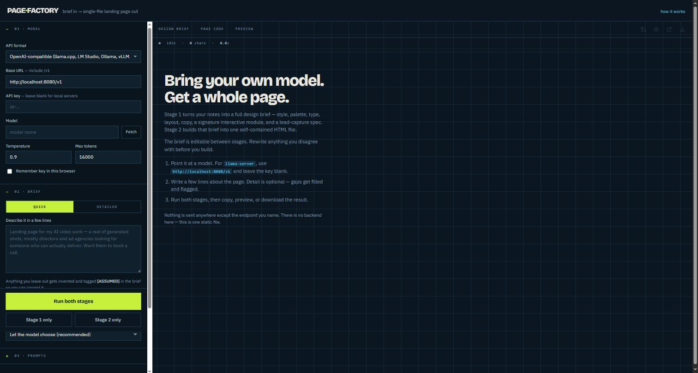
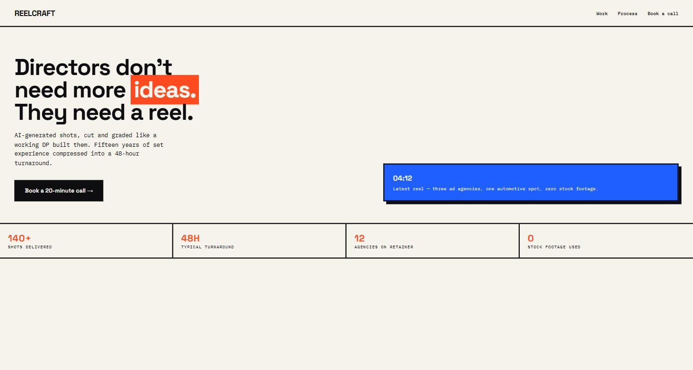
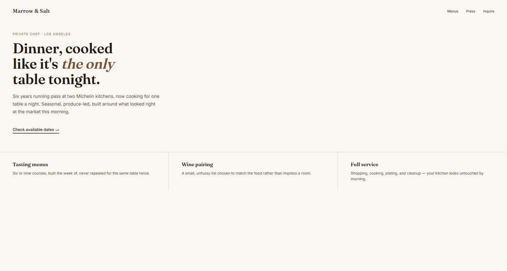

<div align="center">

# 🏭 Page Factory

### Type a few lines about your website. Get a real one back — in seconds.

No coding experience needed. No sign-up. No backend. Just your idea, in, and a finished, working website, out.

[](LICENSE)
[](index.html)
[](https://github.com/c1t1zen1/page-factory/stargazers)
[](https://c1t1zen1.github.io/page-factory/)
[](index.html)
[](index.html)
[](index.html)
[](https://github.com/c1t1zen1/page-factory/pulls)

### 👉 [**CREATE YOUR WEBSITE NOW →**](https://c1t1zen1.github.io/page-factory/) 👈

*(it's free, it's instant, and it runs entirely in your browser)*

</div>

---

## What is this, actually?

Page Factory is one HTML file that turns a short description — "landing page for my dog-walking business" — into a complete, good-looking, ready-to-publish website. You don't write any code. You don't install anything. You just describe what you want, click a button, and watch it build the page in front of you.

It's aimed squarely at people who've **never touched HTML** and don't want to. If you can type a sentence, you can make a website.

Under the hood it talks to an AI model to do the actual writing and designing — but you bring your own model (that's the "bring your own key" part), so there's no subscription, no account, and nothing running on anyone's server but your own browser.

<p align="center">
  
</p>

## Why people like it

- **Simple.** One text box. Describe your business or idea in plain English. That's the whole learning curve.
- **Fast.** Two short AI steps and you have a finished page — usually well under a minute once it's running.
- **Fun.** Watching a real design brief and a real webpage write themselves in front of you, live, never gets old.
- **Yours.** The output is a normal `index.html` file. Download it, host it anywhere, edit it in Notepad, hand it to a developer — it's not locked into anything.
- **Honest about gaps.** If you leave something out, the AI invents something reasonable and clearly marks it `[ASSUMED]` so you know exactly what to double-check or change.

## See it in action

Every generated page is different — the tool deliberately avoids the "every AI website looks the same" trap by picking a genuinely different visual style each time, based on what you're describing. Here are two examples generated from two very different one-line briefs:

<table>
<tr>
<td width="50%" align="center">
<br>
<sub><b>Input:</b> "Landing page for my AI video work — directors and ad agencies looking for someone who can deliver."</sub>
</td>
<td width="50%" align="center">
<br>
<sub><b>Input:</b> "Landing page for a private chef in LA, upscale, books through referrals only."</sub>
</td>
</tr>
</table>

Same tool, same two-step process, two completely different websites — because two completely different businesses shouldn't look the same.

## How it works

Making the page happens in two quick steps:

1. **Stage 1 — The Brief.** You type a few lines about your site. The AI turns that into a real design plan: colors, fonts, layout, the actual words on the page, even a custom interactive touch — all before a single line of code is written.
2. **Stage 2 — The Build.** The AI takes that plan and writes it into one complete, working `index.html` file — ready to open, preview, or publish immediately.

You can read and tweak the brief between the two steps, so if the AI assumed something wrong (say, the wrong city or the wrong tone), you fix it *before* it gets built — not after.

## Get started in 60 seconds

1. Open **[the live tool](https://c1t1zen1.github.io/page-factory/)** — nothing to download.
2. Point it at an AI model. The easiest option if you don't have one yet: get a free or low-cost key from [OpenAI](https://platform.openai.com) or [OpenRouter](https://openrouter.ai), paste it in, pick "OpenAI-compatible."
3. Type a few lines describing your website in plain language.
4. Click **Run both stages** and watch it build.
5. Preview it, then hit **Download** — you now own a finished website.

Prefer to run it on your own computer instead of the hosted version? Download `index.html` from this repo and open it directly in any browser, or serve it locally:

```bash
python3 -m http.server 4000
# then open http://localhost:4000
```

## Endpoints it works with

The **API Provider** dropdown has one entry per runtime. Pick yours and the base URL fills itself in:

| Provider option | Base URL it sets | Key needed? |
|---|---|---|
| `llama.cpp (llama-server)` | `http://localhost:8080/v1` | No |
| `Ollama` | `http://localhost:11434/v1` | No |
| `LM Studio` | `http://localhost:1234/v1` | No |
| `OpenAI` | `https://api.openai.com/v1` | Yes |
| `Anthropic` | `https://api.anthropic.com/v1` | Yes |
| `OpenRouter` | `https://openrouter.ai/api/v1` | Yes |
<!-- NVIDIA NIM is intentionally disabled in the GitHub Pages build. Uncomment
this row and the marked blocks in index.html when deploying with a same-origin/
server-side proxy. -->
<!-- | `NVIDIA NIM` | `https://integrate.api.nvidia.com/v1` | Yes — use through a same-origin/server-side proxy from the hosted app | -->
| `Custom (OpenAI-compatible)` | whatever you type — vLLM, Groq, Mistral, DeepSeek and friends live here | Only if the server asks |

Hit **Fetch** and the Model dropdown rebuilds itself from what that endpoint actually serves — the old list is cleared first, every time, so nothing from the previous provider is left behind. Switching provider does the same refresh on its own, and **Custom / Enter manually…** at the bottom of the list covers any model the endpoint doesn't advertise.

## Two snags newcomers hit (and the fix)

**"It won't connect to my local model."** This is almost always one of two things:

- **Mixed content** — a page loaded over `https://` (like this hosted one) can't call `http://localhost`. Either run the tool locally over plain `http://` too (see the command above), or put a proper HTTPS certificate in front of your local server.
- **CORS** — start `llama-server` with `--host 0.0.0.0`, and for Ollama set `OLLAMA_ORIGINS=*`. Both send the right permissions by default otherwise they don't.

The app tells you which one you hit right when it happens, so you're never guessing.

## A few tips for best results

- Set **max tokens** to at least 16000 — a full page is long, and a cut-off build is the most common hiccup. The status bar flags it for you.
- Temperature around `0.9` works well for the creative brief step; lower it if you want the build step to be more literal. **Reasoning effort** replaces Temperature directly below the Model picker for native Claude models and for OpenRouter models whose model metadata advertises its unified `reasoning` parameter. Other OpenAI-compatible endpoints use Temperature because they do not share one documented reasoning-effort control across all hosted models.
- Your API key only ever gets stored in *your own browser* if you tick "Remember key," and it's only ever sent to the endpoint you chose. Nothing passes through any third-party server.
<!-- NVIDIA NIM is intentionally disabled in the GitHub Pages build. Uncomment
this note when re-enabling the provider for a deployment with a same-origin/
server-side proxy. -->
<!-- - **NVIDIA NIM requires a proxy in the hosted GitHub Pages app.** NVIDIA's cloud endpoint does not permit requests from this page's browser origin, so point the **Custom** provider at a same-origin/server-side proxy that forwards requests to NVIDIA NIM. This is a browser CORS restriction, not an API-key or model-setting issue. -->
- The actual prompts that drive the AI live right in the **PROMPTS** panel in the app — feel free to read them, learn from them, or rewrite them entirely. That's the real product; the interface is just the runner.

---

<div align="center">

### Got an idea for a website? Stop staring at a blank page.

## 🚀 [**CREATE YOUR WEBSITE NOW →**](https://c1t1zen1.github.io/page-factory/)

</div>

---

## License

MIT — do what you like with it. See [LICENSE](LICENSE).
