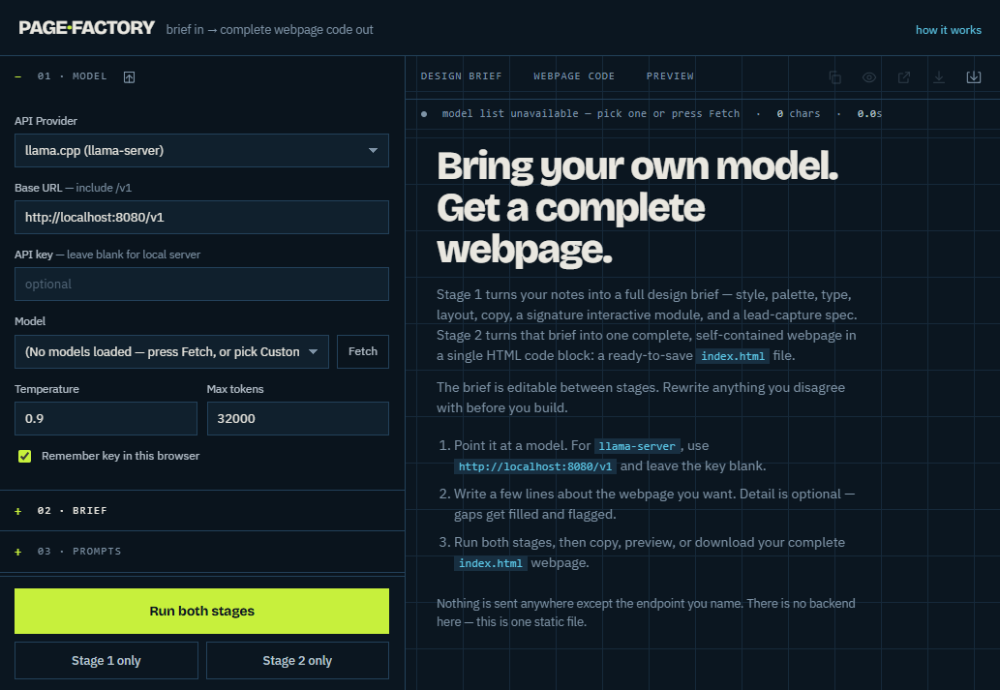
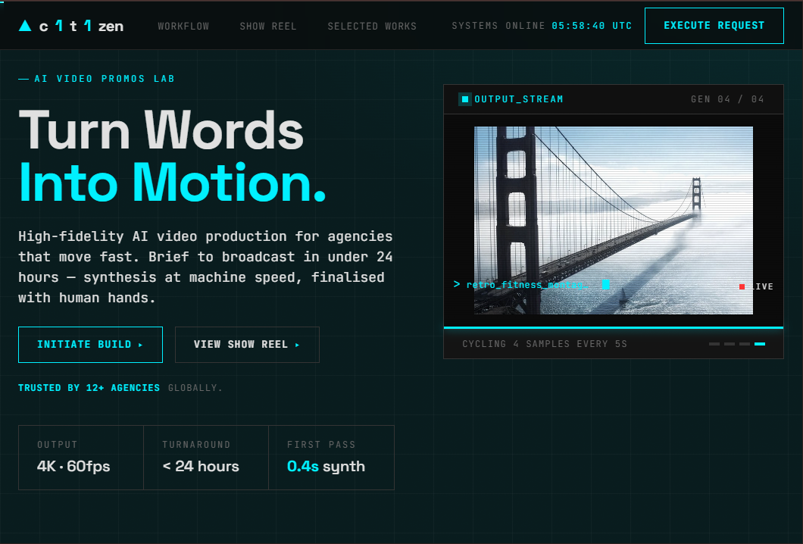
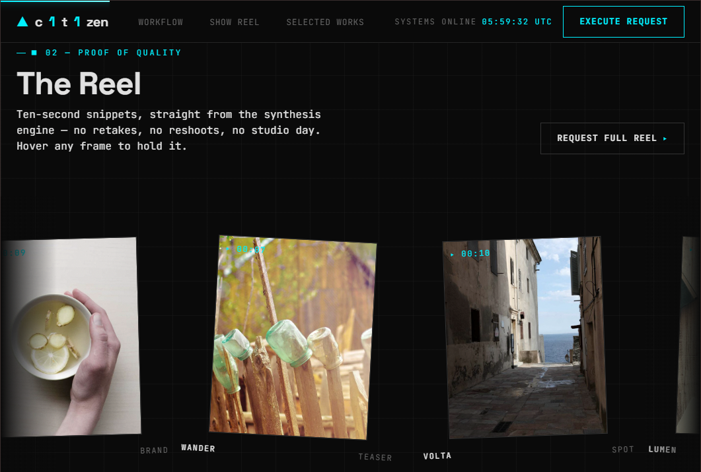

<div align="center">

# 🏭 Page Factory

### Describe a website idea. Generate a complete, editable webpage.

**A beginner-friendly, bring-your-own-AI tool that turns a short description into a self-contained `index.html` webpage.**

[](https://c1t1zen1.github.io/page-factory/)
[](LICENSE)
[](https://github.com/c1t1zen1/page-factory/commits/main)
[](https://github.com/c1t1zen1/page-factory)
[](https://github.com/c1t1zen1/page-factory/stargazers)
[](https://github.com/c1t1zen1/page-factory/forks)
[](https://github.com/c1t1zen1/page-factory/pulls)
[](index.html)
[](index.html)

### [Create a webpage →](https://c1t1zen1.github.io/page-factory/)

</div>

---

<p align="center">
  
</p>

## What is Page Factory?

Page Factory helps you create a **webpage** without starting from a blank document or writing code first. Tell it what you want—for example, “a friendly webpage for my dog-walking business with an appointment button”—and an AI model creates a design brief, then turns that brief into a complete webpage.

The result is a normal `index.html` file containing the HTML, CSS, and JavaScript needed for the generated webpage. You can preview it, download it, open it in a browser, publish it with a web host, or give it to a developer to continue editing.

This repository is deliberately simple:

- **One static HTML application.** No install, build process, server, or database is required to run Page Factory itself.
- **Bring your own AI.** You choose the AI provider or local model and connect it with your own API key when one is required.
- **Your connection goes directly to your chosen endpoint.** Page Factory does not send your prompt through its own backend because it does not have one.
- **You stay in control.** The design brief, prompts, and generated webpage code are all visible and editable.

> **New to coding?** An API is simply a way for this webpage to ask an AI service to do work. An API key is a private password for that service. Never share your API key or commit it to a public repository.

## What can it do?

| Feature | What it means for you |
| --- | --- |
| **Two-stage generation** | First, the AI creates a clear design brief. Second, it builds the complete webpage from that brief. |
| **Editable design brief** | Review and change the AI’s plan before generating the final webpage. Missing details are marked as `[ASSUMED]` so you can correct them. |
| **Quick or detailed input** | Start with a few plain-language sentences, or use the full brief fields to specify audience, goals, tone, constraints, and more. |
| **Reference website input** | Paste a public website URL and use **Pull** to bring its readable text into your brief as reference material. |
| **Style selection** | Let the AI choose a visual direction or select a style to guide the generated webpage. |
| **Custom prompts** | View, edit, simplify, reset, or ask the selected AI to rewrite either generation prompt. |
| **Live output controls** | Run both stages together, run either stage separately, or stop an in-progress request. |
| **Preview and export** | Copy the generated webpage code, preview it inside the app, open it in a new tab, or download it as `index.html`. |
| **Project save and restore** | Export a project JSON file with your settings, prompts, design brief, and generated webpage code; import it later to continue. API keys are excluded from project exports. |
| **Local or cloud AI support** | Connect to llama.cpp, Ollama, LM Studio, OpenAI, Anthropic, OpenRouter, or another OpenAI-compatible API. |

## See a generated webpage

Page Factory can use the same idea to create very different visual directions. These two screenshots are from a generated AI-video-studio webpage: the first shows its hero section and the second shows a reel section farther down the same webpage.

<table>
  <tr>
    <td width="50%" align="center">
      <br>
      <sub>Generated webpage: hero section</sub>
    </td>
    <td width="50%" align="center">
      <br>
      <sub>Generated webpage: reel section</sub>
    </td>
  </tr>
</table>

## How it works

Page Factory uses two AI steps so you can catch mistakes before code is created:

1. **Stage 1 — Design brief:** You describe the webpage. The AI turns your notes into a plan for the audience, content, layout, colors, typography, calls to action, and interactive details.
2. **Review:** Read and edit the design brief. If the AI guessed the wrong city, audience, service, or tone, change it here.
3. **Stage 2 — Webpage builder:** The AI uses the approved design brief to write a complete, self-contained `index.html` webpage.
4. **Use your webpage:** Preview it, copy the code, open it in a new tab, download `index.html`, or export the whole Page Factory project for later.

## Quick start: create your first webpage

### Option A: use the live version

1. Open the **[live Page Factory webpage](https://c1t1zen1.github.io/page-factory/)**.
2. In **01 · MODEL**, choose your AI provider.
3. Enter your API key if that provider requires one. For a local model, leave the key blank unless your local setup requires it.
4. Click **Fetch** beside **Model**, then choose a model. If your provider does not list models, choose **Custom / Enter manually** and type the model name.
5. In **02 · BRIEF**, describe the webpage you want. Example:

   ```text
   Create a welcoming webpage for my dog-walking business in Austin.
   My customers are busy pet owners. Explain my services, show pricing,
   add testimonials, and include a button to request a walk.
   ```

6. Click **Run both stages**.
7. Review the **DESIGN BRIEF**, then select **WEBPAGE CODE** or **PREVIEW** to inspect your finished webpage.
8. Click the download icon to save the generated webpage as `index.html`.

### Option B: run the tool from this repository

1. Download this repository or clone it with Git:

   ```bash
   git clone https://github.com/c1t1zen1/page-factory.git
   cd page-factory
   ```

2. Open `index.html` in your browser. You can also serve the folder locally, which is helpful when connecting to a local AI server:

   ```bash
   python -m http.server 4000
   ```

3. Visit `http://localhost:4000` in your browser and follow the same steps above.

There are no packages to install and no `npm install` command for this project.

## Connect your own AI API

Choose a provider in **01 · MODEL**. Page Factory fills in a suggested base URL; you can change it if your provider gives you a different endpoint.

| Provider in Page Factory | Suggested base URL | Do you need an API key? | Best for |
| --- | --- | --- | --- |
| **llama.cpp (llama-server)** | `http://localhost:8080/v1` | Usually no | A model running on your own computer with llama.cpp. |
| **Ollama** | `http://localhost:11434/v1` | Usually no | A model running locally through Ollama. |
| **LM Studio** | `http://localhost:1234/v1` | Usually no | A local model served by LM Studio. |
| **OpenAI** | `https://api.openai.com/v1` | Yes | OpenAI models using your OpenAI API key. |
| **Anthropic** | `https://api.anthropic.com/v1` | Yes | Claude models using your Anthropic API key. |
| **OpenRouter** | `https://openrouter.ai/api/v1` | Yes | A choice of models available through OpenRouter. |
| **Custom (OpenAI-compatible)** | Set your own URL | Depends on the service | Compatible services such as vLLM, Groq, Mistral, or DeepSeek. |

### Cloud API setup

For OpenAI, Anthropic, OpenRouter, or another cloud provider:

1. Create an account with that provider.
2. Create an API key in the provider’s dashboard.
3. In Page Factory, select the provider and paste the key into **API key**.
4. Click **Fetch** to load available models, then choose one.
5. Set **Max tokens** high enough for a full webpage. The default `16000` is a practical starting point.
6. Run Stage 1 and Stage 2.

Cloud providers may charge for API usage. Check the provider’s pricing and usage limits before generating large or repeated webpages.

### Local AI setup

For llama.cpp, Ollama, or LM Studio:

1. Start your local AI server and make sure it exposes an OpenAI-compatible `/v1` API.
2. Select the matching provider in Page Factory.
3. Confirm the **Base URL** matches your local server.
4. Click **Fetch**, choose your local model, and generate your webpage.

If the hosted Page Factory webpage cannot reach `http://localhost`, run Page Factory locally with the Python command above. Browsers block many requests from an HTTPS webpage to a local HTTP server; this is called **mixed content**. Your server may also need to allow the browser with **CORS** settings. The app displays guidance when a connection fails.

## Important privacy and security notes

- Page Factory sends prompts and generated output directly between your browser and the endpoint you choose.
- It has no Page Factory backend, database, account system, or subscription service.
- Your API key is saved in browser storage **only** if you enable **Remember key in this browser**.
- Project exports intentionally do **not** contain API keys or the remember-key preference.
- Treat an API key like a password. Do not paste it into a generated webpage, screenshot, issue, commit, or public chat.

## Tips for better generated webpages

- **Give useful details.** Mention who the webpage is for, what visitors should do, what content is essential, and the mood you want.
- **Use the design brief as a checkpoint.** Correct assumptions before Stage 2 instead of asking the AI to repair finished code later.
- **Keep the webpage focused.** One clear goal—booking, subscribing, requesting a quote, joining a waitlist—usually produces a stronger result.
- **Use style thoughtfully.** Letting the model choose works well; selecting a style is useful when you already know the visual direction you want.
- **Adjust generation controls when needed.** Lower temperature for more literal output. Use reasoning effort only when the selected model supports it.
- **Save your work.** Download `index.html` for the finished webpage and use **Export project** when you want to preserve your settings, prompts, brief, and output together.

## Publish your generated webpage

After downloading `index.html`, you have a standard static webpage file. You can:

1. Double-click it to open it locally in a browser.
2. Upload it to a static host such as GitHub Pages, Netlify, Cloudflare Pages, or your web hosting account.
3. Give the file to a developer to customize, connect forms, add analytics, or integrate a backend.

Generated webpages may need human review before publishing—especially for facts, pricing, contact details, accessibility, legal language, form handling, and anything that makes claims about a business or service.

## Contributing

Ideas, documentation improvements, bug reports, and pull requests are welcome. Please open an issue or pull request with a clear explanation of the change.

## License

This project is available under the [MIT License](LICENSE).
